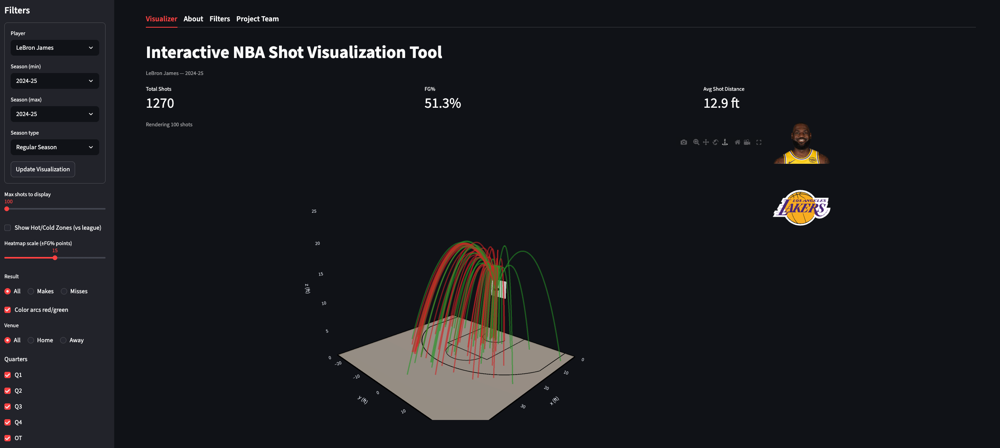

## Project Summary

CourtSpace 3D is an interactive Streamlit application for exploring NBA player shot patterns through a 3D half-court visualization. The app allows users to select a player, season range, and shot context, then view each shot as a 3D trajectory over a realistic NBA half court.

The project was built as a sports analytics and data visualization tool using Python, Streamlit, Plotly, pandas, NumPy, and the `nba_api` package.

[View Live App](https://courtspace3d-v4.streamlit.app/)  
[View GitHub Repository](COURTSPACE_REPO_LINK_HERE)

## Project Motivation

Traditional NBA shot charts are usually shown as flat 2D visuals. While useful, those charts can make it difficult to quickly understand shot trajectory, spatial patterns, and player efficiency in a more intuitive way.

CourtSpace 3D was designed to make shot chart data more interactive and visually engaging. Instead of only showing where a shot was taken, the app renders each attempt as a 3D arc from the shot location to the basket. Users can then filter the visualization by player, season, shot type, opponent, venue, quarter, distance, and make/miss result.

## My Role

This was a collaborative project with Arvind Madan.

My primary contributions focused on building the foundation of the visualization tool:

- Created the first working prototype using a static LeBron James shot dataset
- Implemented the initial Streamlit version of the app
- Built the core visualization pipeline for rendering player shot attempts as 3D trajectories
- Added hover text metadata for shot-level context
- Added quarter filtering
- Built the full hot/cold zone heatmap mode
- Added the user-controlled heatmap scaling slider
- Designed the caching system used to handle NBA API requests efficiently

## Partner Contributions

Arvind Madan expanded the app with advanced filters and user interface improvements, including:

- Max-shots slider
- Makes/misses filter
- Home/away venue filter
- Shot distance filter
- Shot type filter
- Opponent filter
- Automatically updating player and team images
- Multi-season query functionality

Together, these contributions produced an interactive app that combines NBA shot chart data, 3D rendering, contextual filtering, and league-relative efficiency analysis.

## App Preview

{fig-align="center"}

## Key Features

### Interactive 3D Shot Arcs

Each shot is rendered as a 3D trajectory from its court location to the rim. Makes and misses can be colored differently, allowing users to quickly identify successful and unsuccessful shot attempts.

### Realistic NBA Half-Court Geometry

The app builds a realistic half-court scene with a floor, paint, free throw line, restricted area, three-point line, rim, and backboard. The court geometry is defined in feet to match NBA-style dimensions.

### Player and Season Selection

Users can select an NBA player and choose either a single season or a multi-season range. The app supports both regular season and playoff data.

### Contextual Shot Filters

The app allows users to filter shots by:

- Makes and misses
- Home or away games
- Quarter and overtime
- Shot distance
- Shot type
- Opponent
- Maximum number of shots displayed

### Shot Profile Summary Metrics

For the selected view, the app reports summary metrics such as:

- Total shots
- Field goal percentage
- Average shot distance

### Hot/Cold Zone Heatmap

The hot/cold zone heatmap compares a player's field goal percentage by court region against league average. This helps identify where a player shoots better or worse than the league from specific areas of the floor.

The heatmap is calculated as:

```text
Player FG% - League FG%
```

Positive values indicate areas where the player shoots above league average, while negative values indicate areas where the player shoots below league average.

## How the App Works

The app uses `nba_api` to retrieve player shot chart data from NBA Stats. After the user selects a player and season range, the app loads player shot attempts and league-average zone data.

The visualization pipeline then:

1. Loads player and league shot data
2. Adds venue and opponent information
3. Applies user-selected filters
4. Converts NBA shot coordinates into court coordinates
5. Builds a 3D half-court using Plotly
6. Renders shot attempts as 3D arcs
7. Optionally overlays the league-relative hot/cold zone heatmap

## Technical Highlights

- Built a modular Streamlit app with separate source files for data loading, filtering, court geometry, shot arcs, heatmap logic, zone classification, and 3D rendering
- Used cached NBA API calls to reduce unnecessary requests and improve app performance
- Converted NBA shot chart coordinates into a custom 3D court coordinate system
- Rendered shot attempts as quadratic Bezier arcs from shot location to the rim
- Compared player shooting efficiency to league-average zone performance
- Added performance controls to limit the number of rendered shots for smoother interaction

## Tools Used

Python, Streamlit, Plotly, pandas, NumPy, `nba_api`, GitHub, and Streamlit Community Cloud.

## Skills Demonstrated

- Sports analytics
- Interactive dashboard development
- Data visualization
- API-based data collection
- Spatial data processing
- Feature filtering and user interface design
- 3D visualization with Plotly
- Streamlit app deployment
- Collaborative project development

## Known Limitations

The app depends on NBA Stats data through `nba_api`, so load times and availability can depend on the NBA Stats endpoint. Older seasons may also contain less consistent shot-tracking data because of historical differences in NBA data collection.

Rendering thousands of 3D arcs can also be computationally heavy, so the app includes a maximum shot display slider and sampling logic to improve performance.

## Repository

The full project repository contains the Streamlit app, helper modules, requirements file, and documentation.

[View Live App](https://courtspace3d-v4.streamlit.app/)  
[View GitHub Repository](https://github.com/mxngojuice/CourtSpace3D-v4/tree/main)