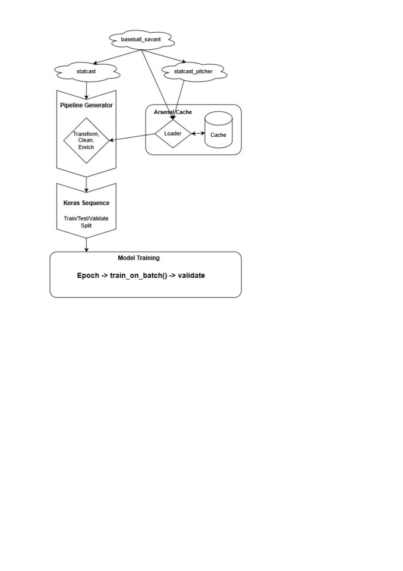
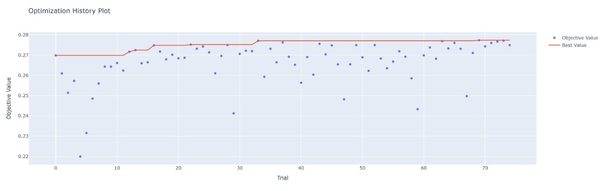
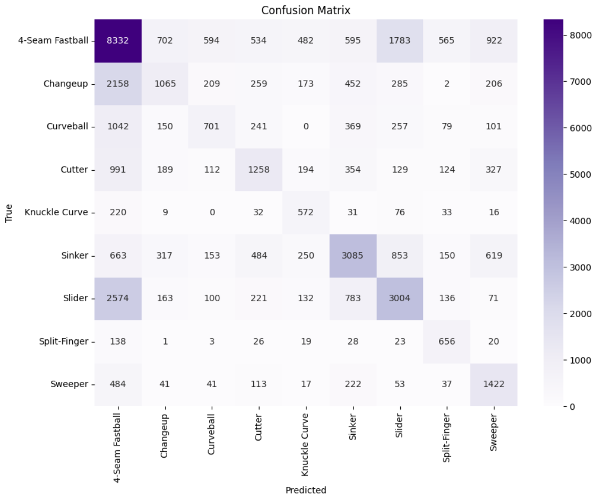

## Project Summary

Pitch Forecaster is a collaborative machine learning project focused on predicting the next pitch type in an MLB plate appearance. The central question was simple but difficult: **what type of pitch is a batter likely to see next?**

The project used public pitch-level baseball data, game-context variables, pitch sequencing features, pitcher and batter tendencies, and multiclass classification models to explore how historical pitch patterns can be used to forecast future pitch selection.

This project was completed for **DATA 780: Machine Learning** in the UNC Chapel Hill Master of Applied Data Science program.

<!-- Add this link once the repository is public:
[View GitHub Repository](https://github.com/elliottw-23/pitch-forecaster)
-->

## Team

This was a collaborative project with [Arvind Madan](https://www.linkedin.com/in/arvind-aditya-madan-08271174/) and [Elliott Walker](https://www.linkedin.com/in/walkere23/).

The project combined research, data engineering, feature construction, model development, and evaluation to build a functional next-pitch prediction pipeline.

## Project Motivation

Baseball is one of the most data-rich sports, and pitch sequencing is a natural machine learning problem because every pitch is influenced by prior events, player tendencies, count, game state, and strategic context.

The goal of this project was not to predict pitch type from physical pitch characteristics after the pitch was thrown. Instead, the goal was to use information available before the next pitch to estimate what type of pitch would come next.

Potential applications include:

- Baseball strategy analysis
- Pitch sequencing research
- Broadcast and fan engagement tools
- Player tendency analysis
- Sports betting and probability modeling contexts
- Machine learning experimentation in a highly contextual sports domain

## Data Sources

The project used public baseball data sources connected to Statcast and Baseball Savant. The final pipeline integrated data from:

- `statcast`
- `statcast_pitcher`
- Baseball Savant bulk pitch-level data

The data included pitch-level records, game context, pitcher information, batter information, and historical pitch tendencies.

## Feature Engineering

A major part of the project involved converting raw pitch-level data into model-ready features. The pipeline included:

- Cleaning pitch-level records
- Removing rare or inconsistent pitch labels
- Creating lagged pitch-sequence features
- Grouping lagged features by game and pitcher to avoid sequence leakage across appearances
- Encoding pitcher/batter handedness matchups
- Creating score differential features
- Adding game-context variables
- Enriching observations with pitcher-specific arsenal tendencies
- Enriching observations with batter-specific tendencies
- Preparing data for both classical machine learning models and neural network training

The use of lagged features was especially important because pitch selection is sequential. A pitcher's previous choice can influence the next pitch, but the feature engineering needed to preserve the correct game and pitcher ordering so that the first pitch of one appearance did not incorrectly reference the final pitch of another sequence.

## Pipeline Architecture

{fig-align="center" width="70%"}

The modeling pipeline was designed to stream pitch-level data through cleaning, transformation, feature enrichment, and train/validation/test splitting. The architecture also included pitcher and batter arsenal caches so the model could incorporate historical tendency information without repeatedly recomputing those features.

## Modeling Approach

The project evaluated multiple multiclass classification approaches.

### Logistic Regression Baseline

The first model was a multinomial logistic regression baseline. This model provided a useful comparison point and helped establish how difficult the classification problem was before moving to more flexible approaches.

### Random Forest

The random forest model was used to capture nonlinear relationships between pitch type, game context, pitcher tendencies, and batter context. It improved overall accuracy compared with the baseline and performed well on more common pitch types.

### Neural Network

The neural network was designed to improve class-wise performance, especially for underrepresented pitch types. Hyperparameters were tuned using **Optuna**, and the validation strategy grouped MLB teams into division-based folds to test generalization across different teams and game contexts.

The neural network search evaluated architecture choices such as:

- Number of hidden layers
- Neurons per layer
- ReLU vs. Leaky ReLU activations
- Dropout rates
- L2 regularization
- Learning rate
- Batch size
- Class-weight scaling
- Early stopping settings

### Ensemble Model

The final model combined the random forest and neural network predictions. The ensemble used a weighted combination of the two model outputs, with a 70/30 split favoring the neural network.

This approach was chosen because the random forest had stronger overall accuracy and interpretability, while the neural network performed better on class-wise balance for underrepresented pitch types.

## Hyperparameter Tuning

{fig-align="center"}

The neural network was tuned with Optuna using a hybrid metric that balanced overall accuracy, mean F1, and minimum F1. This helped the model selection process account for both general prediction accuracy and performance on underrepresented pitch classes.

## Final Results

The final ensemble model produced the most balanced results across the evaluated models.

Key results:

- Overall accuracy: **46%**
- Macro F1 score: **0.42**
- Improved minority-class performance compared with earlier models
- Stronger balance between overall accuracy and class-wise fairness
- Better performance on underrepresented pitch types than the baseline models

The model still reflected the difficulty of the problem. Pitch prediction is highly contextual, class-imbalanced, and strategically noisy. However, the final results showed that pitcher tendencies, batter context, game state, and pitch sequencing can provide meaningful predictive signal.

## Key Takeaways

The project showed that next-pitch prediction is not just about individual pitch characteristics. Effective prediction depends on combining several layers of context:

- Pitch sequencing
- Pitcher arsenal tendencies
- Batter tendencies
- Handedness matchups
- Game state
- Score context
- Class imbalance across pitch types

The project also showed why accuracy alone is not enough for this kind of multiclass sports prediction problem. Some pitch types are much more common than others, so model evaluation needed to consider class-wise F1 scores and minority-class performance.

## Final Model Performance

The final ensemble model combined neural network and random forest predictions to balance overall accuracy with stronger class-wise performance across imbalanced pitch types.

| Metric | Final Ensemble Result |
|---|---:|
| Accuracy | 46% |
| Macro F1 | 0.42 |
| Weighted F1 | 0.45 |

{fig-align="center"}

The confusion matrix shows that the model performed best on more common pitch types such as four-seam fastballs, sinkers, and sliders, while still improving balance across less frequent pitch classes compared with earlier models.

## Technical Highlights

- Built a machine learning pipeline for next-pitch multiclass classification
- Engineered lagged features to represent previous pitch context
- Used pitcher and batter arsenal tendencies to enrich model inputs
- Developed a streaming-style data pipeline for large pitch-level datasets
- Implemented logistic regression, random forest, neural network, and ensemble models
- Tuned neural network hyperparameters using Optuna
- Used a hybrid evaluation metric balancing accuracy, mean F1, and minimum F1
- Evaluated model generalization using division-based validation splits
- Addressed class imbalance across pitch types
- Compared classical machine learning and neural-network-based approaches

## Tools Used

Python, pandas, scikit-learn, TensorFlow/Keras, Optuna, NumPy, Baseball Savant data, Statcast data, Jupyter Notebook, and GitHub.

## Skills Demonstrated

- Sports analytics
- Machine learning
- Multiclass classification
- Feature engineering
- Sequential data modeling
- Data cleaning
- Model evaluation
- Hyperparameter tuning
- Neural networks
- Ensemble modeling
- Class imbalance handling
- Technical research communication

## Limitations

The project was limited by hardware constraints, especially memory limitations when working with larger multi-season pitch-level datasets. The final model showed meaningful predictive power, but there is still room to improve performance by training on more seasons, adding richer batter-specific outcome tendencies, and exploring more advanced sequence models.

Pitch prediction also has a natural ceiling because baseball strategy is intentionally unpredictable. The fact that a model cannot perfectly predict the next pitch is part of what makes the sport strategically interesting.

## Future Work

Future versions of this project could improve the modeling framework by:

- Training on additional MLB seasons
- Adding batter-specific performance by pitch type
- Incorporating richer pitcher-batter matchup history
- Testing recurrent neural networks or transformer-based sequence models
- Applying dimensionality reduction with PCA or autoencoders
- Building a lightweight API for real-time next-pitch probability predictions
- Extending the task from pitch type prediction to pitch outcome prediction

## Repository

The GitHub repository contains the final model notebook, reports, and supporting project materials. It is not currently public, but once it is will be added as a link on this page.

<!-- Add this once the repository is public:
[View GitHub Repository](https://github.com/elliottw-23/pitch-forecaster)
-->