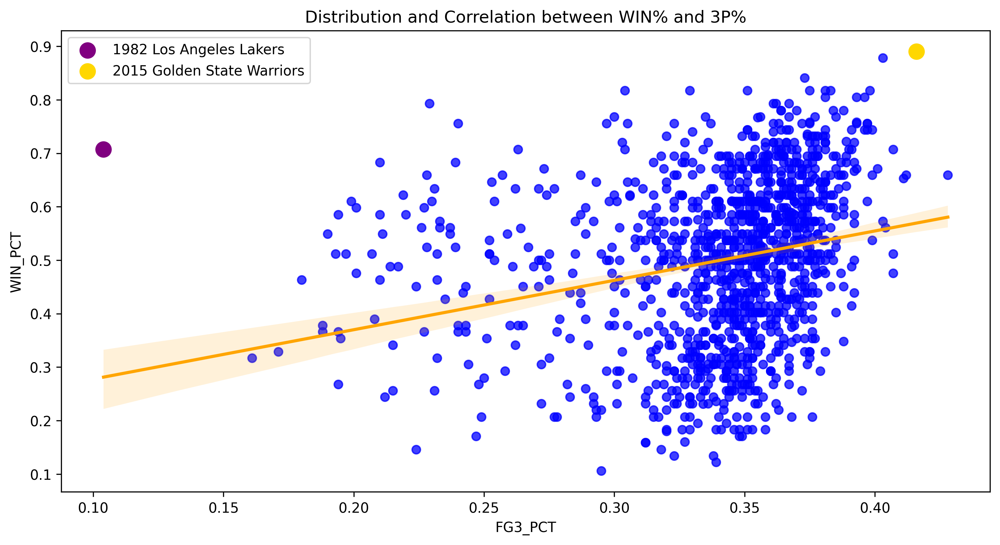

## Project Summary

This project explores how NBA three-point shooting relates to team success across historical seasons. The analysis focuses on whether teams that attempt more threes, make more threes, or shoot a higher three-point percentage tend to win more games.

Rather than only looking at modern basketball, the project uses year-over-year team-level data to compare teams across different NBA eras. This makes it possible to see both the long-term growth of the three-point shot and the changing relationship between perimeter shooting and winning.

[View GitHub Repository](https://github.com/djfulk-22/The-Three-Point-Effect)

## Research Question

How strongly are NBA teams' three-point shooting statistics related to winning percentage?

More specifically, this project evaluates three core shooting indicators:

- Three-point attempts per game
- Three-point makes per game
- Three-point percentage

The goal was not just to determine whether three-point shooting matters, but to understand which three-point metrics are most closely associated with team success.

## Data and Collection Process

The dataset was collected using the `nba_api` Python package, specifically the `TeamYearByYearStats` endpoint. The data includes historical team-level statistics such as wins, losses, win percentage, three-point makes, three-point attempts, and three-point percentage.

A major data preparation step involved standardizing historical franchise names. Because NBA teams have relocated or changed names over time, older team names such as the Charlotte Bobcats, New Orleans Hornets, Seattle SuperSonics, and New Jersey Nets had to be mapped to consistent franchise names.

The data collection process also accounted for NBA Stats API reliability issues by using request headers, longer timeouts, retry logic, and local CSV outputs.

## Methods

The analysis was completed in Python and included the following steps:

- Collected historical team-level NBA data using `nba_api`
- Cleaned and standardized franchise names across team history
- Created per-game three-point shooting features
- Compared three-point attempts, makes, and percentage against win percentage
- Built scatterplots with regression lines to visualize relationships
- Identified notable outlier teams from different NBA eras
- Used linear regression to evaluate how much three-point shooting metrics explain variation in winning

## Key Visualization 1: Growth of Three-Point Shooting Over Time

{fig-align="center"}

This visualization shows how dramatically NBA three-point usage has increased over time. Three-point attempts per game and makes per game both rise sharply, especially in the modern NBA. League-wide three-point percentage improved earlier in the three-point era and then became more stable as the shot became a normal part of team offense.

The visualization also helps show how different NBA eras can produce very different winning profiles. The 1982 Los Angeles Lakers stand out as a high-winning team from an era when three-point usage was still extremely limited. In contrast, the 2015 Golden State Warriors represent a modern championship-level team built around elite three-point volume and efficiency.

## Key Visualization 2: Three-Point Percentage and Winning Percentage

{fig-align="center"}

This scatterplot shows the relationship between team three-point percentage and win percentage. The overall pattern suggests that teams shooting better from three-point range tend to win more games, but the relationship is not perfect.

The outliers are important because they show how the relationship between three-point shooting and success has changed over time. The 1982 Los Angeles Lakers were highly successful despite low three-point usage, while the 2015 Golden State Warriors represent a modern example of a team whose success was closely tied to high-volume, high-efficiency three-point shooting.

## Main Findings

The project found a positive relationship between three-point shooting and team success, especially when looking at three-point percentage. Teams that shot more efficiently from three-point range generally had higher winning percentages.

However, the analysis also showed that three-point shooting is only one part of team success. Some teams won at a high level without relying heavily on the three-point shot, especially in earlier eras. Modern teams, meanwhile, are more likely to use three-point shooting as a central part of their offensive identity.

The main takeaway is that three-point shooting is meaningfully related to winning, but the strength and interpretation of that relationship depends heavily on era, team style, and overall roster quality.

## Skills Demonstrated

- Python data analysis
- API-based data collection
- Data cleaning and standardization
- Sports analytics
- Exploratory data analysis
- Feature engineering
- Data visualization
- Correlation and regression analysis
- Interpretation of historical trends
- GitHub project documentation

## Tools Used

Python, pandas, matplotlib, seaborn, scikit-learn, `nba_api`, Jupyter Notebook, and GitHub.

## What I Would Improve Next

Future versions of this project could expand the analysis beyond simple three-point indicators by incorporating additional team context, such as offensive rating, defensive rating, pace, playoff performance, shot location data, or player-level roster construction.

Another useful extension would be to model the relationship by era instead of treating all seasons as part of one combined dataset. This would help separate the early three-point era from the modern spacing-focused NBA and provide a clearer view of how the value of three-point shooting has changed over time.

## Repository

The full repository includes the notebook, collected data outputs, cached NBA API files, and the complete README with additional technical details.

[View GitHub Repository](https://github.com/djfulk-22/The-Three-Point-Effect)