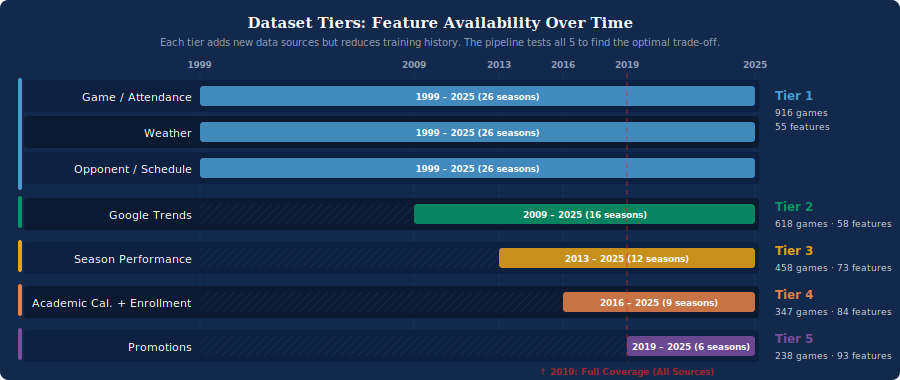
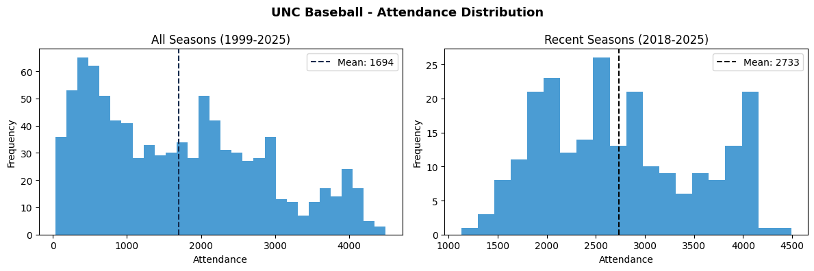
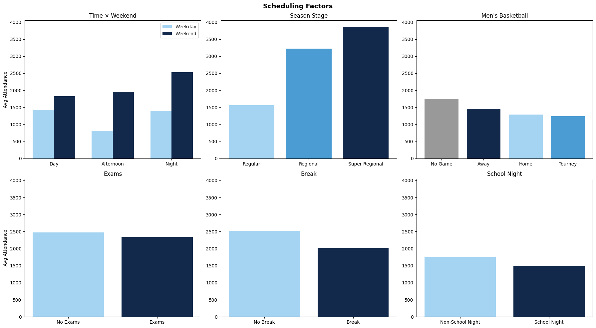
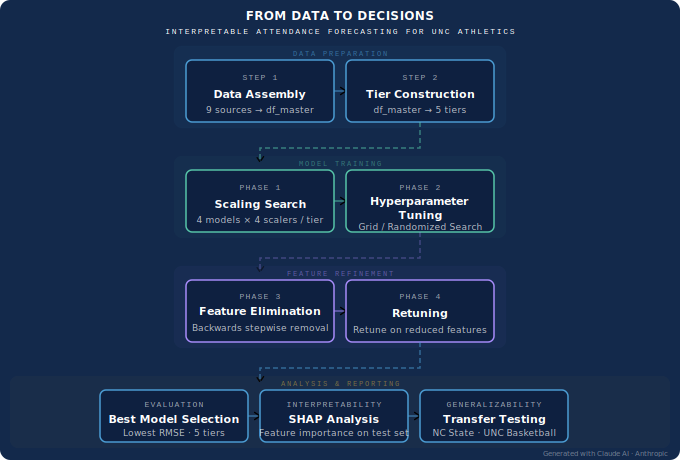
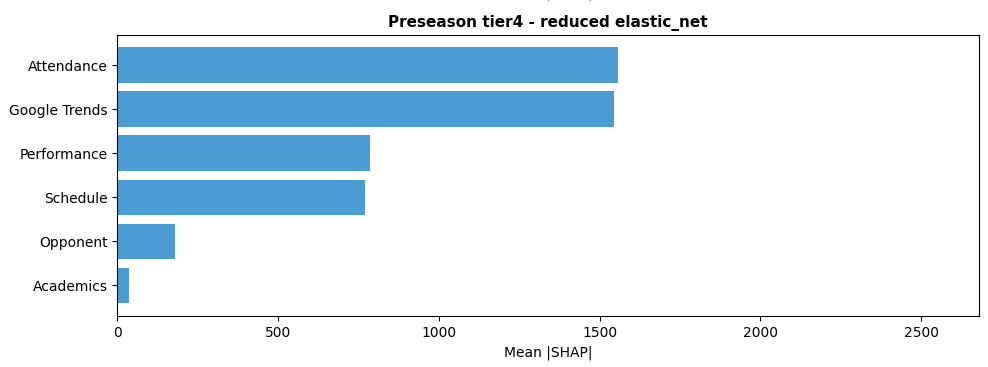
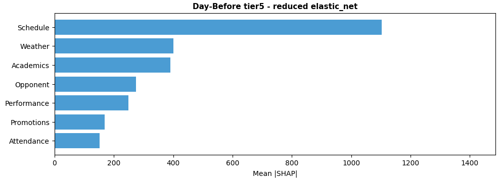

## Project Summary

UNC Baseball Attendance Prediction is a collaborative MADS capstone project with [Adam Cooke](https://www.linkedin.com/in/adamcookeunc/) and [Arvind Madan](https://www.linkedin.com/in/arvind-aditya-madan-08271174/) for UNC Athletics. The project built an end-to-end attendance forecasting framework and Streamlit decision-support application for UNC baseball home games using historical attendance, opponent context, scheduling features, weather, academic calendar timing, Google Trends, promotions, and team performance data.

The project was designed to help UNC Athletics move from attendance planning based mostly on historical averages and scheduling intuition toward a more proactive, data-informed workflow for staffing, marketing, concessions, promotions, and game-day operations.

[View Streamlit App](https://unc-baseball-attendance-forecasting.streamlit.app/)  
[View Public App Repository](https://github.com/djfulk-22/Personal-S26-TeamA3-App-Repo-)  

Full project analysis repository link will be added once the complete capstone repository is publicly available.

## Stakeholder Context

UNC Athletics hosts home events across many teams, and attendance affects operational planning, staffing, marketing effectiveness, resource allocation, and fan experience. For UNC baseball, game-day turnout can vary substantially depending on opponent, schedule timing, weather, promotions, team performance, academic calendar context, and broader fan interest.

The goal of this project was to build a forecasting framework that could generate useful game-level attendance projections and present those forecasts in a way that non-technical stakeholders could use for planning decisions.

## Team and Contributions

This was a collaborative project with [Adam Cooke](https://www.linkedin.com/in/adamcookeunc/) and [Arvind Madan](https://www.linkedin.com/in/arvind-aditya-madan-08271174/).

### My Role

My primary responsibilities focused on performance-data scraping, Streamlit development, and documentation.

My contributions included:

- Built the performance-data scraper for UNC and opponent game-level metrics
- Engineered and integrated performance variables such as scoring, home runs, strikeouts, win percentage, and team-strength indicators
- Developed the Streamlit application used to present preseason and midseason forecasts interactively
- Refined the app layout, calendar view, game-detail view, data explorer, and stakeholder-facing display logic
- Contributed to project documentation and the final project writeup
- Continuously refined both the scraper and app as project needs evolved

### Partner Contributions

[Adam Cooke](https://www.linkedin.com/in/adamcookeunc/) led the GoHeels.com attendance scraper, project infrastructure, feature-tier setup, supporting datasets, GitHub organization, and stakeholder coordination.

[Arvind Madan](https://www.linkedin.com/in/arvind-aditya-madan-08271174/) led data cleaning, feature engineering, master dataset integration, backward feature elimination, weighted cross-validation, preseason workflow adaptation, and additional weather- and attendance-related feature engineering.

All team members contributed to the final presentation and broader project development.

## Project Objectives

The project had four primary objectives:

1. Identify key drivers of attendance for UNC baseball home games
2. Build predictive models to forecast game-day attendance at the event level
3. Create interpretable dashboards that make projections accessible to non-technical stakeholders
4. Deliver actionable insights for staffing, promotions, marketing, and operations planning

Although the project focused on UNC baseball, the methodology was designed to be scalable to other sports, venues, and institutions.

## Data Sources

The modeling dataset combined multiple source files into a unified game-level dataset for UNC baseball.

Major data sources included:

- UNC baseball attendance and schedule data scraped from GoHeels.com
- UNC and opponent game-level performance data from NCAA stats game logs
- Academic calendar data from UNC Registrar archives
- Enrollment data
- Google Trends web search interest
- Google Trends YouTube search interest
- Team home coordinates and travel-related context
- ACC and opponent-group mappings
- Promotion and event-context data

Additional datasets were also assembled for generalization testing on NC State baseball and UNC men's basketball.

## Feature Engineering

Feature engineering focused on building variables that reflected information available at different forecasting horizons while avoiding data leakage.

Feature groups included:

- Schedule and game context
- Opponent characteristics
- Attendance history
- Academic calendar timing
- Fan interest signals
- UNC and opponent performance
- Weather and near-term forecast variables
- Promotions
- Geographic and travel-related context

Because different data sources began in different seasons, the project used a tiered dataset structure. Lower tiers preserved longer historical windows with fewer features, while higher tiers added richer contextual data but had shorter training histories.

## Tiered Dataset Design

{fig-align="center" width="90%"}

The project used five feature tiers to evaluate the tradeoff between more historical data and richer contextual information.

| Tier | Start Season | Added Feature Groups |
|---|---:|---|
| Tier 1 | 2000+ | Schedule and attendance history |
| Tier 2 | 2010+ | Google Trends |
| Tier 3 | 2014+ | Team and opponent performance |
| Tier 4 | 2016+ | Academic calendar and enrollment detail |
| Tier 5 | 2019+ | Promotions |

This design allowed the team to test whether additional feature richness improved forecasts enough to justify the reduced historical sample size.

## Exploratory Analysis

Exploratory analysis showed that attendance increased substantially over time, especially in recent seasons, while still exhibiting meaningful game-to-game variation.

{fig-align="center" width="90%"}

The distribution of attendance also showed that the evaluation seasons came from a higher-attendance regime than much of the earlier historical data, making the forecasting task more challenging.

### Scheduling Effects

{fig-align="center" width="100%"}

Scheduling variables showed strong relationships with attendance. Weekend games generally outperformed weekday games, night games tended to draw stronger crowds, and postseason settings such as regionals and super regionals were associated with substantially higher attendance.

Academic timing also mattered. School nights, exams, and breaks showed differences in turnout, which supported the inclusion of academic-calendar features in the modeling pipeline.

## Forecasting Horizons

The project evaluated two operational prediction settings.

### Preseason Forecast

The preseason model was designed to predict the full home schedule before opening day using only information available before the season started.

This setting supports:

- Seasonal staffing expectations
- Budget planning
- Concessions planning
- Early identification of likely high-demand games
- Early promotional planning

### Two-Day-Ahead Update Forecast

The two-day-ahead model was designed to refine predictions shortly before each game using updated contextual information.

This setting supports:

- Final staffing decisions
- Parking and gate planning
- Concessions preparation
- Short-term promotional adjustments
- Weather-informed operational decisions

The deployed workflow was extended to support predictions up to two days before game time so the Streamlit app could surface forecasts for games close enough to have current contextual data.

## Modeling Pipeline

{fig-align="center" width="95%"}

The modeling workflow used chronological validation rather than random splits. This better reflected the real forecasting problem because future games must be predicted using only past information.

The project evaluated five model families:

- Linear Regression
- Elastic Net
- Random Forest
- XGBoost
- LightGBM

The modeling process included:

- Weighted rolling cross-validation
- Seasonal decay weighting to prioritize recent seasons
- Hyperparameter tuning with Optuna
- Backward feature elimination
- Re-optimization on reduced feature sets
- Final rolling predictions for 2024, 2025, and forward-looking 2026 games

Seasons 2020 and 2021 were excluded because attendance was artificially constrained during the COVID era, and 2008 was excluded because Boshamer Stadium was under reconstruction.

## Model Results

The best model differed by forecast horizon.

| Forecast Context | Best Tier | Model | RMSE | MAE | R² | MAPE | Within 500 | vs. Baseline |
|---|---:|---|---:|---:|---:|---:|---:|---:|
| Preseason | Tier 4 | Elastic Net | 406 | 330 | 0.6128 | 11.6% | 82% | +38.8% |
| Two-Day-Ahead | Tier 5 | Elastic Net | 326 | 260 | 0.8048 | 9.1% | 88% | +48.0% |

The two-day-ahead model improved RMSE by 80 attendees, or about 19.7%, relative to the best preseason model. This showed the value of incorporating near-term information such as weather forecasts, current-season performance, recent attendance behavior, and in-season fan-interest signals.

## Key Findings

Several findings stood out:

- Elastic Net was the best-performing model family across the winning forecast settings.
- The best preseason model came from Tier 4, where richer contextual features improved forecasts without sacrificing too much historical depth.
- The best two-day-ahead model came from Tier 5, showing that the richest feature set was most useful close to game day.
- Near-term context reduced forecast error by nearly 20% compared with preseason prediction.
- Preseason forecasts were useful for strategic planning, while two-day-ahead forecasts were better suited for tactical operations.
- Attendance drivers changed depending on when the prediction was made.

## Interpretability

SHAP-based interpretability analysis was used to understand which feature groups influenced the winning models.

### Preseason Model Drivers

{fig-align="center" width="90%"}

For the winning preseason Tier 4 model, the most important feature groups were attendance history and Google Trends, followed by performance and schedule. This suggests that before the season begins, the model relies heavily on historical demand, preseason public attention, and prior-season team context.

### Two-Day-Ahead Model Drivers

{fig-align="center" width="90%"}

For the winning two-day-ahead Tier 5 model, schedule was the strongest feature group by a large margin, followed by weather, academics, opponent context, and performance. This reflects the importance of near-term operational context when the prediction is made close to game day.

## Streamlit Application

The project includes a deployed Streamlit application that allows users to explore UNC baseball attendance forecasts in a simple decision-support format.

[View Streamlit App](https://unc-baseball-attendance-forecasting.streamlit.app/)  
[View Public App Repository](https://github.com/djfulk-22/Personal-S26-TeamA3-App-Repo-)

The app supports both preseason and midseason forecasting views. Users can:

- Choose a season
- Switch between preseason and midseason predictions
- Filter by month
- Review season-level summary metrics
- View predicted attendance on a calendar-style schedule
- Inspect individual games in detail
- Explore filtered prediction data in table form
- Compare actual and predicted attendance when actuals are available

The app is intended to support both strategic planning and short-term operational decision-making. Preseason predictions provide a full-schedule planning view before opening day, while midseason predictions incorporate updated information for games closer to being played.

## Automated Refresh and Deployment Workflow

The project also included a local-to-cloud refresh pipeline that keeps the deployed app updated as new data becomes available.

The refresh workflow:

1. Scrapes and refreshes the latest UNC baseball schedule and attendance data
2. Builds updated game-level performance features
3. Runs the scoring notebook to generate prediction files
4. Writes updated CSVs into `APP/data`
5. Performs sanity checks on the expected app outputs
6. Pushes updated app-facing files to GitHub only when the files have changed

The automation runs locally on a Mac using `launchd`, a shell script, and a Python refresh orchestrator. The deployed Streamlit app then reads the updated committed files from the repository.

This workflow allowed the app to function as a live forecasting tool rather than a static class project.

## Generalization Testing

The team also tested whether the modeling framework could generalize beyond UNC baseball. The UNC baseball model configurations were applied directly to:

- NC State baseball
- UNC men's basketball

The transfer tests showed that the core modeling recipe could beat baseline in multiple contexts. However, the importance of specific feature groups varied by sport and venue.

For example, attendance history mattered more for baseball, where game-to-game attendance varies substantially. Schedule timing mattered more for basketball, where attendance is closer to capacity and there is less variation to predict.

## Actionable Insights

The final project produced several practical recommendations for UNC Athletics:

- Use preseason forecasts for big-picture planning before opening day
- Use two-day-ahead forecasts for final staffing, concessions, parking, and promotional decisions
- Adjust short-term expectations when weather conditions change
- Treat historical demand as a strong baseline, but refine it with near-term context
- Use fan-interest signals to identify games that may draw more attention than schedule context alone suggests
- Evaluate feature importance separately before transferring the framework to another sport

## Technical Highlights

- Built an end-to-end attendance forecasting framework for UNC baseball
- Integrated scraped attendance data with NCAA performance metrics and contextual datasets
- Engineered forecast-safe features for preseason and short-term prediction settings
- Evaluated multiple model families across tiered feature sets
- Used weighted rolling cross-validation to reflect real forecasting conditions
- Applied backward feature elimination and model re-optimization
- Built a stakeholder-facing Streamlit application
- Created an automated local refresh pipeline for app-facing prediction files
- Tested transferability to NC State baseball and UNC men's basketball

## Tools Used

Python, pandas, scikit-learn, XGBoost, LightGBM, Optuna, SHAP, Streamlit, Selenium, Jupyter Notebook, GitHub, Open-Meteo, Google Trends, GoHeels.com data, and NCAA stats data.

## Skills Demonstrated

- Sports analytics
- Predictive modeling
- Data scraping
- Data engineering
- Feature engineering
- Time-aware validation
- Model evaluation
- Streamlit application development
- Dashboard design
- Automation workflow design
- Stakeholder communication
- Technical documentation
- Collaborative data science development

## Limitations

Several limitations should be considered:

- Different feature groups had uneven historical coverage, which created tradeoffs between richer features and longer training windows.
- COVID-era attendance restrictions and Boshamer Stadium reconstruction required excluding some seasons.
- Promotion data was only available in more recent seasons.
- Short-horizon forecasts depend on updated data such as weather, recent attendance, and current-season team performance.
- Some external demand factors, such as ticket presales, local events, and media attention, were not available.
- SHAP analysis is useful for model interpretation but should not be interpreted as proving causal relationships.

## Future Work

Future extensions could include:

- Annual model retraining after each completed season
- Integration of ticket presales or scan data
- A mid-range forecast horizon for one to two weeks ahead
- Expansion to additional UNC sports
- More detailed promotion-effect modeling
- Richer campus and local-event context
- Prediction intervals or uncertainty bands in the app
- More systematic transfer testing across sports and venues
- Operational what-if scenario analysis in the Streamlit app

## Repository

The public app repository contains the deployed Streamlit application and app-facing files used to serve the forecasting dashboard.

[View Public App Repository](https://github.com/djfulk-22/Personal-S26-TeamA3-App-Repo-)

The full capstone repository contains the complete scraping code, modeling notebooks, prediction files, automation scripts, documentation, and project deliverables.

Full project analysis repository link will be added once the complete capstone repository is publicly available.